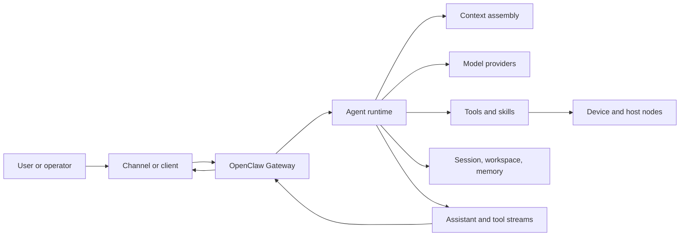
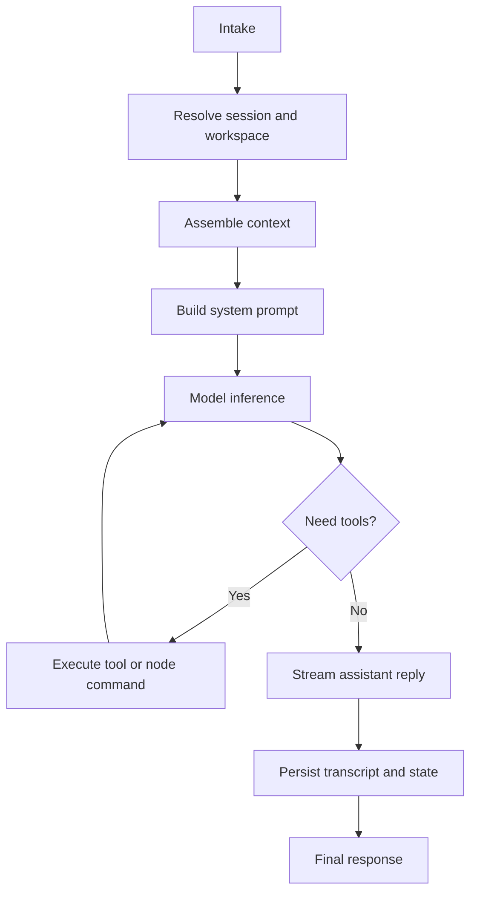

# OpenClaw Architecture Explainer

## Purpose

This document gives workshop attendees a practical mental model for OpenClaw architecture. It is not meant to replace the official OpenClaw docs. It translates the design into a flow that facilitators can teach and operators can use when they are debugging, extending, or explaining an agent workflow.

OpenClaw is easiest to understand as a local-first control plane for useful AI agents:

- the Gateway owns the always-on connections and routing
- clients and channels send requests into the Gateway
- the agent runtime turns intent into model calls, tool calls, streamed output, and persistent session state
- nodes expose device or host capabilities through the same WebSocket control plane
- workspace files, memory, skills, tools, and session history become the context an agent can use

## One-Sentence Model

OpenClaw uses a single long-running Gateway to route messages, clients, nodes, and automations into serialized agent runs that assemble context, call models, execute tools, stream progress, and persist useful state.

## High-Level Diagram



## Component Map

| Component | What it does | Why attendees should care |
|---|---|---|
| Gateway | Long-lived daemon, WebSocket control plane, channel owner, event emitter | If OpenClaw feels offline, start by checking the Gateway. |
| Clients | macOS app, CLI, web UI, automations, WebChat | These are operator surfaces. They send requests and subscribe to events. |
| Channels | WhatsApp, Telegram, Slack, Discord, Signal, iMessage, WebChat | These are entry points. In workshops, keep them secondary until the dashboard works. |
| Nodes | macOS, iOS, Android, or headless workers that declare capabilities | Nodes make local hardware and device actions available without moving all logic into the model. |
| Agent runtime | Runs the real agent loop: context, model, tools, streaming, persistence | This is where a request becomes work. |
| Context | System prompt, workspace files, history, tool results, attachments | Good context is the difference between a useful agent and a confused chatbot. |
| Skills and tools | Extension layer for workflows, commands, APIs, browser, filesystem, shell | This is how OpenClaw acts, not just chats. |
| Session and memory | Transcripts, compaction, workspace files, remembered state | This gives long-running workflows continuity and auditability. |

## Request Flow

1. Input arrives from a client, channel, CLI command, heartbeat, or automation.
2. The Gateway validates and routes the request over the WebSocket protocol.
3. The agent request is accepted quickly and assigned a run id.
4. OpenClaw resolves the session and workspace, then loads relevant skills and bootstrap context.
5. The runtime builds the system prompt and current context window.
6. The model reasons over the request and may call tools.
7. Tool calls execute through local capabilities, plugins, or connected nodes.
8. Assistant text, lifecycle events, and tool events stream back through the Gateway.
9. The transcript, session metadata, and useful state persist for future runs.
10. The final response returns to the originating client or channel.

## The Agent Loop

The agent loop is the path that makes OpenClaw more than a chat interface. It is the full run from intake to durable outcome:



Key teaching point: one session lane is serialized so tool calls and transcript writes do not race each other. That matters when attendees start using OpenClaw for real workflows instead of one-off prompts.

## Context Versus Memory

Context is what the model receives for the current run. Memory is what can persist on disk and be reloaded later.

Context can include:

- OpenClaw's system prompt
- injected workspace files such as `AGENTS.md`, `SOUL.md`, `TOOLS.md`, `IDENTITY.md`, `USER.md`, `HEARTBEAT.md`, and `BOOTSTRAP.md`
- conversation history
- tool schemas and tool results
- attachments, transcripts, images, or audio
- compaction summaries

Memory can include:

- human-readable notes
- workspace files
- session transcripts
- compacted summaries
- durable instructions and project context

Workshop framing: Markdown is not decoration. It is a durable context format that humans can review and agents can use.

## Gateway Protocol Mental Model

OpenClaw's Gateway uses WebSocket JSON frames.

- The first frame is a `connect` handshake.
- Requests look like `type: "req"` with an id, method, and params.
- Responses match the request id and return ok payloads or errors.
- Events are pushed as server events for agent streams, chat, health, presence, heartbeat, cron, and lifecycle updates.
- Side-effecting methods should use idempotency keys so retries do not duplicate sends or agent actions.
- Nodes declare `role: "node"` and list the capabilities or commands they expose.

For a workshop, the practical takeaway is simple: the Gateway is the switchboard. Clients, channels, automations, and nodes speak to it; the agent runtime works behind it.

## Security And Operations Talking Points

- Run the Gateway locally first, usually on loopback.
- Pair new devices intentionally.
- Treat channel setup as powerful and sensitive because it can expose real communication surfaces.
- Keep API keys, private data, client details, and credentials out of public workshop repos.
- Prefer dashboard success before messaging-channel success in live rooms.
- Use explicit approval and verification habits before letting agents run risky commands.
- Use `/status`, `/context list`, and health checks to debug before guessing.

## How To Use This In Dev Days

### Five-minute architecture explanation

Use this when the room needs a quick map:

1. "Gateway is the always-on switchboard."
2. "Clients and channels send work into the Gateway."
3. "The agent runtime assembles context and talks to the model."
4. "Tools and nodes let the model act."
5. "Session files and Markdown memory make work durable."

### Ten-minute architecture walkthrough

Use the HTML showcase page:

- [OpenClaw architecture showcase HTML](openclaw-architecture-showcase.html)

Suggested facilitator flow:

1. Start with the Gateway diagram.
2. Point out clients, channels, and nodes as different entry surfaces.
3. Walk the request flow from intake to final response.
4. Explain context versus memory with a Markdown example.
5. Close with guardrails: local-first, pairing, secrets, approval, verification.

### Attendee exercise

Ask attendees to open their own OpenClaw workspace and create:

```markdown
# My OpenClaw Workflow Context

## Goal

## Entry Point

## Useful Context Files

## Tools Or Skills Needed

## Data I Should Not Expose

## First Safe Test
```

Then prompt OpenClaw:

```text
Read my workflow context file. Explain which parts of the OpenClaw architecture will be involved in this workflow, then suggest one safe first test.
```

## Sources

- [OpenClaw Gateway architecture](https://docs.openclaw.ai/concepts/architecture)
- [OpenClaw Agent Loop](https://docs.openclaw.ai/concepts/agent-loop)
- [OpenClaw Context](https://docs.openclaw.ai/concepts/context)
- [ClawDocs Architecture Overview](https://clawdocs.org/architecture/overview/)
